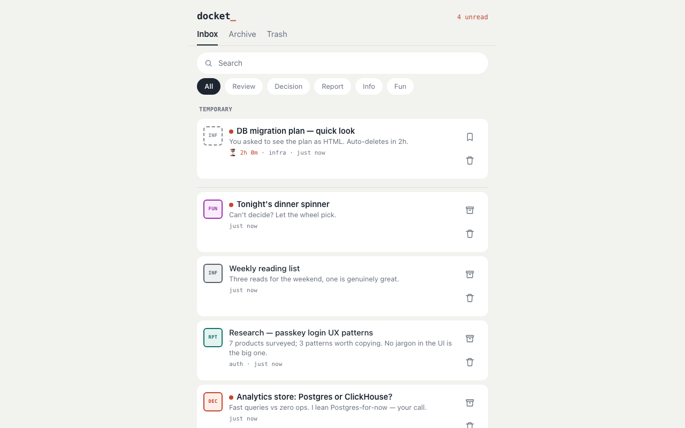
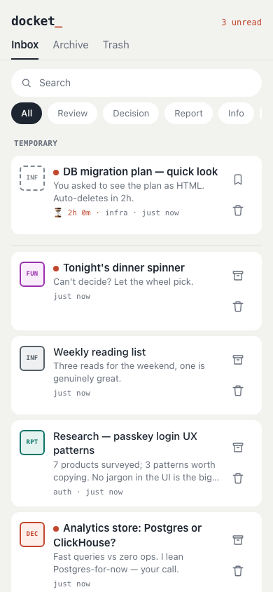
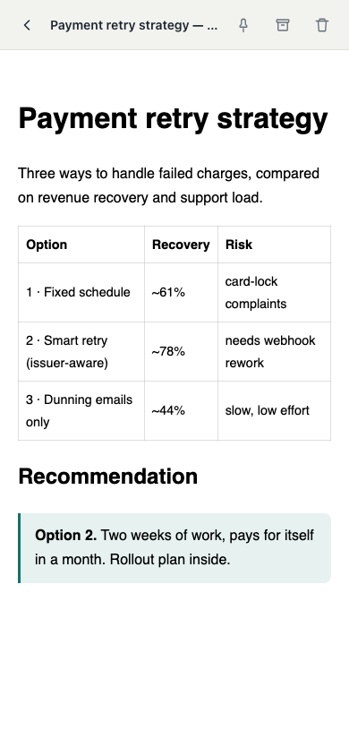
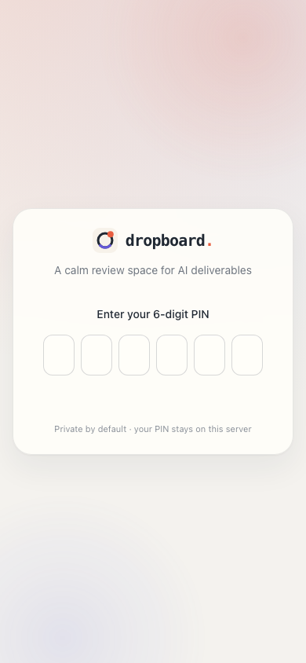

# docketry

**AI 산출물을 위한 셀프호스팅 리뷰 보드.**

  

코딩 에이전트가 설계 문서, 비교 분석, 리서치 리포트를 만들어서 — 채팅창에 쏟아냅니다. 폰에서는 읽기 힘들고, 내일이면 스크롤 속으로 사라지죠. docketry는 에이전트에게 그 산출물을 제대로 된 웹페이지로 게시하는 명령 하나를 주고, 당신에게는 읽고·남기고·흘려보낼 수 있는 모바일 친화적인 받은함을 줍니다.

```
나:  "board에 올려줘"
AI:  docket publish out.html
     --type review --summary …
나:  폰에서 읽고 → 보관. 끝.
```



<p align="center">
  
  
  
</p>

[English README](README.md)

## 사용 흐름

1. **에이전트가 게시합니다.** CLI 한 줄(또는 REST POST)로 HTML/Markdown이 유형 도장·요약·프로젝트 태그가 붙은 보드 항목이 됩니다. 동봉된 스킬 파일로 Claude Code든 Codex든 "board에 올려줘"가 바로 동작합니다.
2. **당신은 리뷰합니다.** 미읽음·검색·유형 필터가 있는 모바일 퍼스트 받은함. 인터랙티브 차트와 인라인 JS까지 원본 그대로, 격리된 뷰어에서 렌더링됩니다.
3. **쌓이지 않습니다.** 보관/휴지통엔 실행취소가 있고, "그냥 보여줘" 용도는 **휘발성**으로 게시됩니다 — 임시 그룹에서 카운트다운이 돌다가 2시간 뒤 스스로 사라집니다. 남기기 한 번이면 보존되고요.

## 이름의 유래

**docket**은 법정에서 심리를 기다리는 안건 목록입니다 — 안건마다 요약이 붙고, 도장이 찍히고, 검토 순서를 기다리죠. 에이전트가 하루 종일 만들어내는 것이 정확히 그렇습니다: 당신의 판단을 기다리는 산출물들. docketry는 그것들이 접수되는 곳이고, UI의 도장 뱃지도 같은 은유입니다. 그래서 CLI 명령도 `docket`입니다.

## 왜 docketry인가

- **에이전트를 가리지 않습니다.** CLI를 실행하거나 REST를 호출할 수 있으면 뭐든 게시할 수 있습니다: Claude Code, Codex, Cursor, aider, 직접 만든 스크립트까지. [`integrations/`](integrations/)에 바로 쓸 수 있는 스킬/프롬프트 파일이 들어 있습니다.
- **채팅이 아니라 리뷰를 위해 만들어졌습니다.** 미읽음 표시, 유형 도장(검토/결정/리포트/정보/재미), 핀 고정, 실행취소가 되는 보관함과 휴지통 — 산출물이 실제로 거치는 수명주기를 그대로 담았습니다. 채팅 기록이나 벤더 아티팩트 패널에는 없는 것들이죠.
- **원하면 휘발됩니다.** `--temp` 항목은 스스로 만료됩니다(기본 2시간) — "그냥 HTML로 보여줘"가 받은함을 어지럽히지 않고, 남길 가치가 있는 것만 탭 한 번으로 보존합니다.
- **셀프호스팅이라 프라이빗합니다.** 산출물이 내 머신을 떠나지 않습니다. UI는 PIN 로그인, 게시 API는 Bearer 토큰으로 보호되고, 모든 아티팩트는 CSP가 걸린 sandbox iframe 안에서 렌더링됩니다 — AI가 생성한 JS는 세션에 손댈 수 없습니다.
- **인프라가 없습니다.** 데이터베이스 없음. 항목 하나 = 폴더 하나(`meta.json` + HTML/Markdown 파일 하나). 백업은 `cp -r`, 검색은 `grep`, 이사는 `mv`면 됩니다. 런타임 의존성은 마크다운 렌더러 하나뿐입니다.
- **산출물의 표현력을 제한하지 않습니다.** 간단한 마크다운 메모(깔끔한 문서 템플릿으로 렌더링)부터 인라인 JS가 도는 완전한 인터랙티브 HTML 페이지까지 — 차트, 토글, 시뮬레이션 전부 동작합니다.

## 빠른 시작

```bash
git clone https://github.com/lunemis/docketry.git && cd docketry
npm install

cat > .env.local <<EOF
DOCKET_TOKEN=$(openssl rand -hex 24)        # 게시 API 인증
DOCKET_PIN=123456                           # UI 로그인용 6자리 PIN
DOCKET_SESSION_SECRET=$(openssl rand -hex 32)
EOF

npm run dev        # http://localhost:3000
```

첫 게시:

```bash
mkdir -p ~/.config/docket
echo '{"url":"http://localhost:3000","token":"<발급한 DOCKET_TOKEN>"}' > ~/.config/docket/config.json
ln -s "$PWD/bin/docket.mjs" ~/.local/bin/docket   # 또는: npm link

docket publish notes.md --type info --summary "첫 항목"
```

보드를 열고 PIN으로 로그인해서 확인하면 됩니다.

UI를 한국어로 쓰려면 `.env.local`에 한 줄 추가:

```bash
NEXT_PUBLIC_DOCKET_LOCALE=ko
```

## 게시하기

```bash
docket publish <파일> [--title 제목] [--type review|decision|report|info|fun]
                      [--project 프로젝트] [--summary 요약] [--tags a,b] [--server URL]
docket list [--status inbox|archived|trash]
```

`.md`/`.markdown` 파일은 내장 문서 템플릿으로 렌더링되고, 그 외에는 그대로 서빙됩니다. 제목을 생략하면 `<title>`/`<h1>`/첫 `#` 헤딩에서 자동으로 뽑습니다.

**휘발성 항목**: `--temp`로 게시하면 스스로 사라지는 항목이 됩니다(기본 2시간, `--temp 30m` / `--temp 1d`) — "이거 그냥 HTML로 보여줘" 용도에 딱 맞습니다. temp 항목은 받은함 상단 *임시* 그룹에 남은 시간과 함께 표시되고, **남기기**를 한 번 누르면 일반 항목으로 승격되며, 아니면 알아서 사라집니다.

REST로 직접 호출할 수도 있습니다:

```bash
curl -X POST $URL/api/items \
  -H "Authorization: Bearer $DOCKET_TOKEN" -H 'Content-Type: application/json' \
  -d '{"title":"...","type":"review","summary":"...","content":"<!doctype html>...","content_type":"html"}'
```

## 에이전트 연동

docketry의 핵심은 "board에 올려줘" 한 마디로 게시가 끝나는 것입니다. [`integrations/`](integrations/)를 참고하세요:

- `claude-code/SKILL.md` — `~/.claude/skills/board/`에 넣기
- `codex/` — 같은 스킬을 `~/.codex/skills/`에 심볼릭 링크
- `generic-prompt.md` — 아무 에이전트의 시스템 프롬프트에 붙여넣기

각 파일에는 아티팩트 품질 규칙(self-contained HTML, 모바일 퍼스트, 라이트/다크, 외부 CDN 금지)이 포함돼 있어서, 에이전트가 폰에서 실제로 잘 읽히는 페이지를 만들게 됩니다.

## 설정

- `DOCKET_TOKEN` (필수) — 게시/API 접근용 Bearer 토큰
- `DOCKET_PIN` (필수) — UI 로그인 6자리 PIN. 5회 실패 시 15분 잠금
- `DOCKET_SESSION_SECRET` (필수) — 세션 쿠키·서명 URL용 HMAC 키
- `DOCKET_DATA_DIR` (기본 `./data/items`) — 항목 저장 위치
- `DOCKET_TRASH_TTL_DAYS` (기본 `30`) — 내장 스위퍼가 휴지통을 비우기까지의 일수. `0`이면 휴지통 정리만 건너뜀 (만료된 temp 항목은 항상 정리)
- `NEXT_PUBLIC_DOCKET_LOCALE` (기본 `en`) — UI 언어 `en`/`ko` (빌드 타임)

## 운영

- **프로덕션**: `npm run build && npm run start -- -p <포트>` — launchd, systemd, pm2, Docker 등 아무 수퍼바이저 아래에서.
- **휴지통 정리**: 자동입니다 — 서버 안에서 내장 스위퍼가 15분마다 돕니다. 외부 스케줄러를 쓰고 싶다면 `DOCKET_TRASH_TTL_DAYS=0`으로 끄고 `npm run cleanup`을 cron에 거세요.
- **외부 접속**: 본인의 터널/리버스 프록시(Cloudflare Tunnel, Tailscale) 뒤에 두면 됩니다. HTTPS로 서빙되면 세션 쿠키에 자동으로 `Secure`가 붙습니다.

## 보안 모델

1인용으로 설계됐습니다. 접근 경로는 세 가지: PIN → 장기 서명 세션 쿠키(UI), Bearer 토큰(API/CLI), 단기 서명 URL(아티팩트 iframe — 샌드박스라 쿠키를 보내지 않기 때문). 아티팩트는 `sandbox allow-scripts`와 CSP sandbox 헤더로 렌더링되어 쿠키·스토리지·부모 DOM에 접근할 수 없습니다.

## 라이선스

[MIT](LICENSE)
