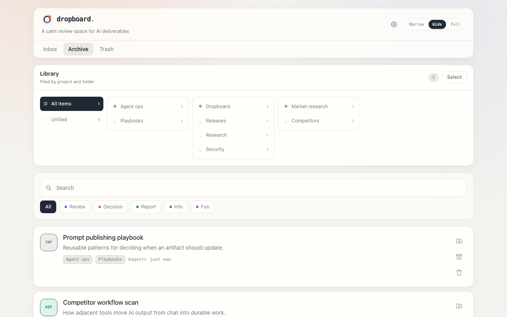

# dropboard

**AI 산출물을 위한 셀프호스팅 리뷰 보드.**

[](https://github.com/lunemis/dropboard/actions/workflows/ci.yml)   

코딩 에이전트가 설계 문서, 비교 분석, 리서치 리포트를 만들어서 — 채팅창에 쏟아냅니다. 폰에서는 읽기 힘들고, 내일이면 스크롤 속으로 사라지죠. dropboard는 에이전트에게 그 산출물을 제대로 된 웹페이지로 게시하는 명령 하나를 주고, 당신에게는 읽고·남기고·흘려보낼 수 있는 모바일 친화적인 받은함을 줍니다.

```
나:  "board에 올려줘"
AI:  dropboard publish out.html
     --type review --summary …
나:  폰에서 읽고 → 보관. 끝.
```




<p align="center">
  
  
  
</p>

[English README](README.md)

## 사용 흐름

1. **에이전트가 게시합니다.** CLI 한 줄(또는 REST POST)로 HTML/Markdown이 유형 도장·요약·프로젝트 태그가 붙은 보드 항목이 됩니다. 동봉된 스킬 파일로 Claude Code든 Codex든 "board에 올려줘"가 바로 동작합니다.
2. **당신은 리뷰합니다.** 미읽음·검색·유형 필터가 있는 모바일 퍼스트 받은함. 인터랙티브 차트와 인라인 JS까지 원본 그대로, 격리된 뷰어에서 렌더링됩니다.
3. **쌓이지 않습니다.** 보관/휴지통엔 실행취소가 있고, "그냥 보여줘" 용도는 **휘발성**으로 게시됩니다 — 임시 그룹에서 카운트다운이 돌다가 2시간 뒤 스스로 사라집니다. 남기기 한 번이면 보존되고요.

## 이름의 유래

동작 그대로입니다: 에이전트가 산출물을 보드에 **툭 올려두면(drop)**, **보드(board)** 가 당신이 볼 때까지 붙들고 있습니다. 도장 뱃지는 각 항목에 어떤 종류의 '봐주기'가 필요한지 — 검토인지, 결정인지, 그냥 읽으면 되는지 — 한눈에 알려주고요.

## 왜 dropboard인가

- **에이전트를 가리지 않습니다.** CLI를 실행하거나 REST를 호출할 수 있으면 뭐든 게시할 수 있습니다: Claude Code, Codex, Cursor, aider, 직접 만든 스크립트까지. [`integrations/`](integrations/)에 바로 쓸 수 있는 스킬/프롬프트 파일이 들어 있습니다.
- **채팅이 아니라 리뷰를 위해 만들어졌습니다.** 미읽음 표시, 유형 도장(검토/결정/리포트/정보/재미), 핀 고정, 실행취소가 되는 보관함과 휴지통 — 산출물이 실제로 거치는 수명주기를 그대로 담았습니다. 채팅 기록이나 벤더 아티팩트 패널에는 없는 것들이죠.
- **원하면 휘발됩니다.** `--temp` 항목은 스스로 만료됩니다(기본 2시간) — "그냥 HTML로 보여줘"가 받은함을 어지럽히지 않고, 남길 가치가 있는 것만 탭 한 번으로 보존합니다.
- **셀프호스팅이라 프라이빗합니다.** 산출물이 내 머신을 떠나지 않습니다. UI는 PIN 로그인, 게시 API는 Bearer 토큰으로 보호되고, 모든 아티팩트는 CSP가 걸린 sandbox iframe 안에서 렌더링됩니다 — AI가 생성한 JS는 세션에 손대거나 외부 네트워크로 요청을 보낼 수 없습니다.
- **인프라가 없습니다.** 데이터베이스 없음. 항목 하나 = `meta.json`, 최초 HTML/Markdown, 업데이트 시 생기는 변경 불가능한 리비전 파일을 담은 폴더 하나입니다. 백업은 `cp -r`, 검색은 `grep`, 이사는 `mv`면 됩니다. 런타임 의존성은 마크다운 렌더러 하나뿐입니다.
- **산출물의 표현력을 제한하지 않습니다.** 간단한 마크다운 메모(깔끔한 문서 템플릿으로 렌더링)부터 인라인 JS가 도는 완전한 인터랙티브 HTML 페이지까지 — 차트, 토글, 시뮬레이션 전부 동작합니다.

## 빠른 시작

```bash
git clone https://github.com/lunemis/dropboard.git && cd dropboard
npm install

cat > .env.local <<EOF
DROPBOARD_TOKEN=$(openssl rand -hex 24)        # 게시 API 인증
DROPBOARD_PIN=123456                           # UI 로그인용 6자리 PIN
DROPBOARD_SESSION_SECRET=$(openssl rand -hex 32)
EOF

npm run dev        # http://localhost:3000
```

첫 게시:

```bash
mkdir -p ~/.config/dropboard
echo '{"url":"http://localhost:3000","token":"<발급한 DROPBOARD_TOKEN>"}' > ~/.config/dropboard/config.json
npm link                                                # `dropboard`를 PATH에 올림 — 모든 OS에서 동작
# Linux/macOS 대안: ln -s "$PWD/bin/dropboard.mjs" ~/.local/bin/dropboard

dropboard publish notes.md --type info --summary "첫 항목"
```

보드를 열고 PIN으로 로그인해서 확인하면 됩니다.

UI를 한국어로 쓰려면 `.env.local`에 한 줄 추가:

```bash
NEXT_PUBLIC_DROPBOARD_LOCALE=ko
```

### Docker Compose

데이터가 영속되는 프로덕션 형태로 로컬에 실행하려면:

```bash
cat > .env <<EOF
DROPBOARD_TOKEN=$(openssl rand -hex 24)
DROPBOARD_PIN=123456
DROPBOARD_SESSION_SECRET=$(openssl rand -hex 32)
NEXT_PUBLIC_DROPBOARD_LOCALE=ko
EOF

docker compose up --build -d
```

`http://localhost:3000`을 열면 됩니다. 아이템은 `dropboard-data` Docker
볼륨에 저장되어 컨테이너를 교체해도 유지됩니다. 호스트 포트는 `.env`의
`DROPBOARD_PORT`로 바꿀 수 있습니다. 언어 설정은 이미지 빌드 시 적용되므로
변경 후 다시 빌드해야 합니다. 컨테이너와 리버스 프록시 상태 확인에는 인증이
필요 없는 `/api/health`를 사용할 수 있습니다.

## 게시하기

```bash
dropboard publish <파일> [--title 제목] [--type review|decision|report|info|fun]
                      [--project 프로젝트] [--folder 상위/하위] [--summary 요약]
                      [--tags a,b] [--key 고정/키] [--note 변경내용]
dropboard update <문서-id> <파일> [--note 변경내용] [--expected N]
dropboard list [--status inbox|archived|trash]
```

`.md`/`.markdown` 파일은 내장 문서 템플릿으로 렌더링되고, 그 외에는 그대로 서빙됩니다. 제목을 생략하면 `<title>`/`<h1>`/첫 `#` 헤딩에서 자동으로 뽑습니다.

**휘발성 항목**: `--temp`로 게시하면 스스로 사라지는 항목이 됩니다(기본 2시간, `--temp 30m` / `--temp 1d`) — "이거 그냥 HTML로 보여줘" 용도에 딱 맞습니다. temp 항목은 받은함 상단 *임시* 그룹에 남은 시간과 함께 표시되고, **남기기**를 한 번 누르면 일반 항목으로 승격되며, 아니면 알아서 사라집니다.

REST로 직접 호출할 수도 있습니다:

```bash
curl -X POST $URL/api/items \
  -H "Authorization: Bearer $DROPBOARD_TOKEN" -H 'Content-Type: application/json' \
  -d '{"title":"...","type":"review","summary":"...","content":"<!doctype html>...","content_type":"html"}'
```

`GET /api/items`는 `status`, `type`, `project`, `q`, `limit`(1–500),
`offset`을 받습니다. 응답에는 `items`, `total`, `limit`, `offset`,
`has_more`가 포함됩니다.

### 살아있는 문서와 버전 기록

ID를 아는 기존 문서는 `dropboard update <문서-id> <파일>`로 수정합니다.
로드맵·스펙·정기 보고서처럼 반복 관리가 명확한 문서는 고정된 `--key
프로젝트/문서-슬러그`로 게시할 수 있습니다. 첫 게시에서는 문서 하나를 만들고,
이후 같은 키를 사용하면 비슷한 카드가 새로 생기는 대신 같은 문서에 변경 불가능한
리비전이 추가됩니다.

업데이트해도 프로젝트·폴더·태그는 유지되며, 문서는 받은함으로 돌아와 미읽음이
되고 최신 수정 시각 기준으로 위에 표시됩니다. 상세 화면의 **vN** 버튼에서 과거
버전을 보거나 복원할 수 있습니다. 복원도 기록을 지우지 않고 새 버전을 만듭니다.
기존 문서는 별도 마이그레이션 없이 자동으로 v1이 됩니다. 업데이트 시 기존 공개
공유 링크는 무효화되므로 새 내용이 과거 링크를 통해 뜻하지 않게 공개되지 않습니다.

`--key`는 문서 정체성이 명확할 때만 사용합니다. Dropboard는 비슷한 제목만으로
문서를 자동 병합하지 않습니다. API의 `expected_revision`을 사용하면 더 최신 수정이
있을 때 조용히 덮어쓰는 대신 `409 Conflict`를 받을 수 있습니다. 휴지통 문서도
`409 Conflict`를 반환하며, 먼저 명시적으로 복원해야 하므로 에이전트가 사용자의
삭제 의사를 조용히 되돌릴 수 없습니다.

### 라이브러리 정리

문서를 보관하면 검토 대기열에서 빠지고 라이브러리로 이동합니다. 프로젝트와
폴더가 없는 문서는 **미분류**에 모이므로 나중에 천천히 정리할 수 있습니다.
문서를 열고 폴더+ 버튼을 누르면 프로젝트, 중첩 폴더 경로, 태그를 수정할 수
있습니다. 라이브러리는 이 정보로 프로젝트/폴더 탐색기를 만들며, 상위 폴더를
선택하면 모든 하위 폴더 문서도 함께 표시합니다.

정리 구조는 실제 파일 이동이 아닌 논리적 메타데이터입니다. 따라서 폴더를
바꾸어도 문서 ID, 북마크, 공유 링크가 유지됩니다. 에이전트는 목적지가 확실할
때 `--folder 리서치/경쟁제품`으로 초기 위치를 지정하고, 불확실하면 비워 두어
사용자가 미분류에서 직접 정리할 수 있습니다.

### 카테고리 편집

보드의 톱니바퀴 버튼에서 **카테고리**를 열면 표시 이름, 색상, 필터 순서,
필터 노출 여부를 바꿀 수 있습니다. 기계가 사용하는 ID인 `review`,
`decision`, `report`, `info`, `fun`은 고정되므로 화면 설정을 바꿔도 기존
에이전트 스킬, CLI 명령, API 연동을 다시 맞출 필요가 없습니다. 카테고리를
숨기면 필터 칩에서만 빠지며, 기존 문서와 해당 ID를 사용하는 새 게시는 계속
동작합니다.

설정은 항목 데이터와 같은 위치의 `_settings/categories.json`에 저장되므로
기존 백업이나 Docker 볼륨에 함께 포함됩니다.

## 에이전트 연동

dropboard의 핵심은 "board에 올려줘" 한 마디로 게시가 끝나는 것입니다. [`integrations/`](integrations/)를 참고하세요:

- `claude-code/SKILL.md` — `~/.claude/skills/board/`에 넣기
- `codex/` — 같은 스킬을 `~/.codex/skills/`에 심볼릭 링크
- `generic-prompt.md` — 아무 에이전트의 시스템 프롬프트에 붙여넣기

각 파일에는 아티팩트 품질 규칙(self-contained HTML, 모바일 퍼스트, 라이트/다크, 외부 CDN 금지)이 포함돼 있어서, 에이전트가 폰에서 실제로 잘 읽히는 페이지를 만들게 됩니다.

## 설정

- `DROPBOARD_TOKEN` (필수) — 게시/API 접근용 Bearer 토큰
- `DROPBOARD_PIN` (필수) — UI 로그인 6자리 PIN. 5회 실패 시 15분 잠금
- `DROPBOARD_SESSION_SECRET` (필수) — 세션 쿠키·서명 URL용 HMAC 키
- `DROPBOARD_UNSAFE_NO_AUTH` (선택, 개발 전용) — `next dev`에서 인증 없이
  실행할 때만 `true`로 설정. 프로덕션에서는 허용되지 않음
- `DROPBOARD_DATA_DIR` (기본 `./data/items`) — 항목 저장 위치
- `DROPBOARD_TRASH_TTL_DAYS` (기본 `30`) — 내장 스위퍼가 휴지통을 비우기까지의 일수. `0`이면 휴지통 정리만 건너뜀 (만료된 temp 항목은 항상 정리)
- `NEXT_PUBLIC_DROPBOARD_LOCALE` (기본 `en`) — UI 언어 `en`/`ko` (빌드 타임)
- `DROPBOARD_PUBLIC_URL` (선택) — 공유 링크를 만들 때 사용할 외부 접근
  가능 base URL. 없으면 요청의 호스트와 포트를 사용함

## 운영

- **프로덕션**: `docker compose up --build -d`를 사용하거나, `npm run build && npm run start -- -p <포트>`를 launchd, systemd, pm2 등의 수퍼바이저 아래에서 실행하세요.
- **휴지통 정리**: 자동입니다 — 서버 안에서 내장 스위퍼가 15분마다 돕니다. 외부 스케줄러를 쓰고 싶다면 서버는 `DROPBOARD_TRASH_TTL_DAYS=0`으로 실행하고, cron에는 원하는 보존 기간을 명시하세요. 예: `DROPBOARD_TRASH_TTL_DAYS=30 npm run cleanup`.
- **외부 접속**: 본인의 터널/리버스 프록시(Cloudflare Tunnel, Tailscale) 뒤에 두면 됩니다. HTTPS로 서빙되면 세션 쿠키에 자동으로 `Secure`가 붙습니다.

### systemd (Linux, root 불필요)

**user** 서비스로 돌리면 됩니다:

```ini
# ~/.config/systemd/user/dropboard.service
[Unit]
Description=dropboard
After=network.target

[Service]
WorkingDirectory=/path/to/dropboard
ExecStart=/usr/bin/env npm run start -- -p 3000
Restart=on-failure

[Install]
WantedBy=default.target
```

```bash
systemctl --user enable --now dropboard
loginctl enable-linger "$USER"   # 필수 — 없으면 다음 로그인 전까지 서비스가 안 뜸
```

`enable-linger`가 놓치기 쉬운 부분입니다: 이게 없으면 user 서비스는 로그인 세션이 살아있는 동안만 돌기 때문에, 리부트 후 dropboard가 조용히 안 올라옵니다. Node를 버전 매니저(nvm 등)로 깔았다면 `ExecStart`를 그 Node의 절대 경로로 지정하세요 — systemd 유닛은 셸 프로필을 읽지 않습니다.

### Windows

launchd/systemd가 없습니다. 권한이 있으면 작업 스케줄러가 되지만, 통제된/회사 관리 머신에서는 권한 상승을 요청하지 않는 per-user 작업조차 `schtasks /create`가 `Access is denied`로 실패할 수 있습니다. 관리자 권한이 필요 없는 대안은 시작프로그램 폴더에 숨김 창 런처를 두는 것입니다:

```vbscript
' dropboard.vbs
Set sh = CreateObject("WScript.Shell")
sh.CurrentDirectory = "C:\path\to\dropboard"
sh.Run "cmd /c npm run start >> ""dropboard.log"" 2>&1", 0, False
```

이 파일을 `%APPDATA%\Microsoft\Windows\Start Menu\Programs\Startup`에 넣으면 매 로그인마다 `next start`가 콘솔 창 없이·권한 상승 없이 조용히 실행됩니다. 정식 Windows 서비스로 만들려면 설치가 가능할 때 [`nssm`](https://nssm.cc/)(`nssm install dropboard`)이 흔히 쓰입니다.

## 아이템 공유하기

아이템을 열고 공유 아이콘을 누르면 24시간짜리 서명된 공개 링크(`/s/<id>?...`)가 만들어져 클립보드에 복사되고, 즉시 회수할 수 있는 옵션도 함께 뜹니다. 링크를 받은 사람은 PIN 없이 그 아이템 하나만 볼 수 있고, 인박스·보관함·휴지통은 볼 수 없습니다. 회수하거나 다시 공유(링크가 새로 발급됨)하면 그 전에 발급된 링크는 아직 만료 전이라도 전부 무효화됩니다.

`DROPBOARD_PUBLIC_URL`을 설정해야 복사된 링크가 실제로 상대방에게 열립니다:
- 같은 내부망 안에서만 → 이 머신의 LAN IP, 예: `http://192.168.1.20:3000` (DHCP 주소라 바뀌면 다시 설정해야 함)
- 인터넷 어디서나 → 터널/리버스 프록시 도메인(Cloudflare Tunnel, Tailscale Funnel 등)

설정하지 않으면 링크는 요청이 들어온 호스트를 그대로 쓰는데, 로컬에서 접속 중이라면 그게 `localhost`라서 본인 머신 밖에서는 열리지 않습니다.

## 보안 모델

1인용으로 설계됐습니다. 접근 경로: PIN → 장기 서명 세션 쿠키(UI), Bearer 토큰(API/CLI), 단기 서명 URL(아티팩트 iframe — 샌드박스라 쿠키를 보내지 않기 때문), 공개 공유 링크(위 참고 — epoch로 회수 가능, 최대 24시간). 아티팩트는 `sandbox allow-scripts`와 제한적인 CSP로 렌더링되어 쿠키·스토리지·부모 DOM에 접근하거나 폼·외부 네트워크로 데이터를 보낼 수 없습니다. self-contained 산출물을 위한 인라인 CSS/JS와 `data:`/`blob:` 미디어는 계속 사용할 수 있습니다.

## 라이선스

[MIT](LICENSE)

기여 방법은 [CONTRIBUTING.md](CONTRIBUTING.md), 보안 문제 제보 방법은
[SECURITY.md](SECURITY.md)를 참고하세요.
