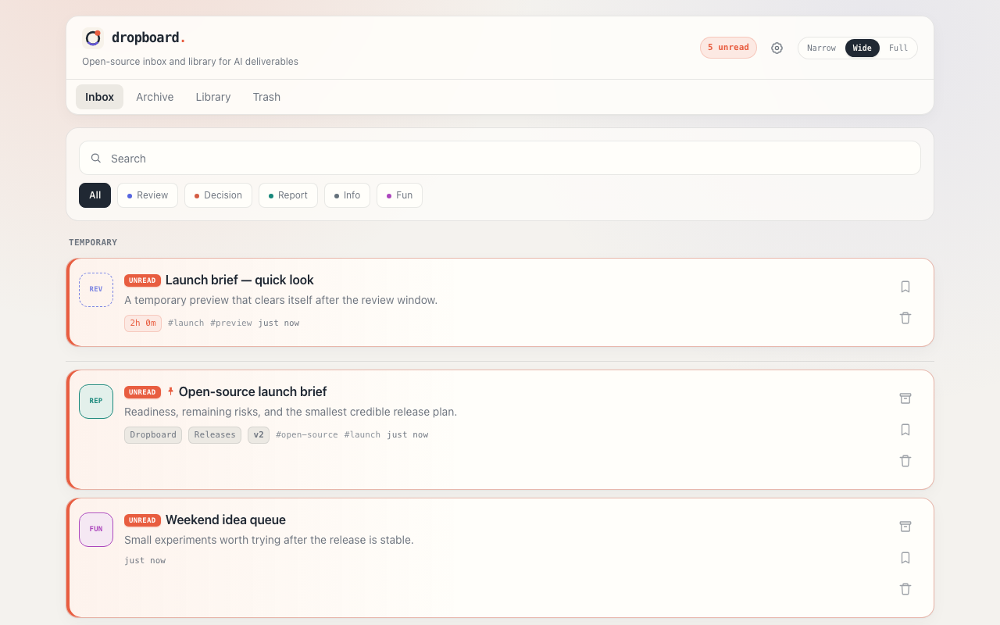
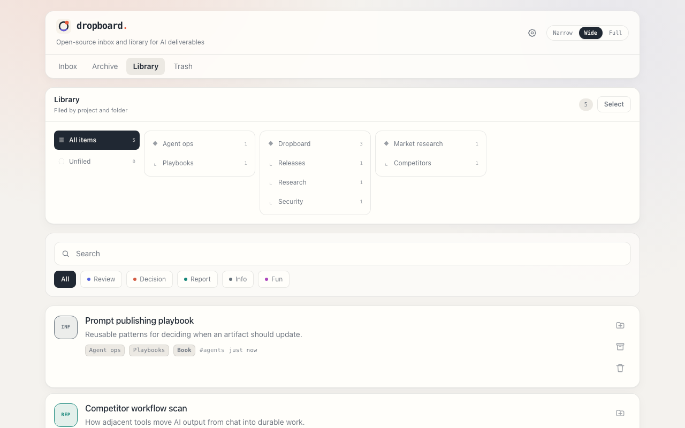
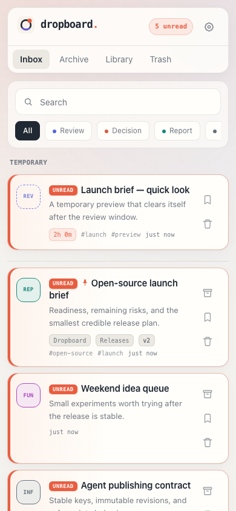
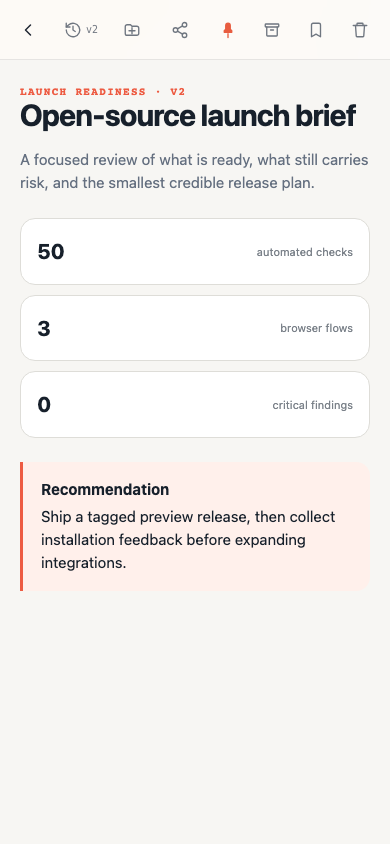
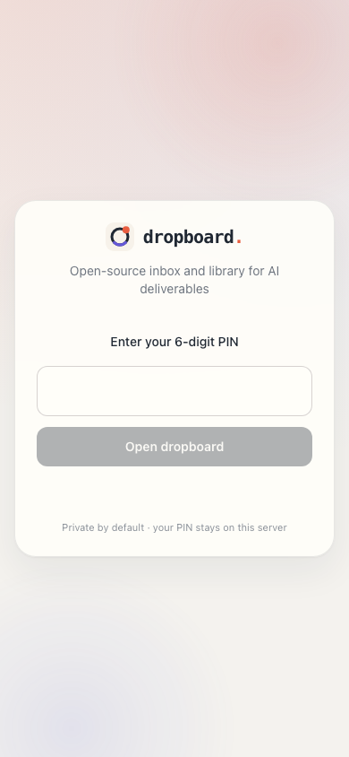

# dropboard

**An open-source inbox and library for AI-generated deliverables.**

[](https://github.com/lunemis/dropboard/actions/workflows/ci.yml)   

Your coding agent writes a design doc, a comparison table, a research report, or a slide deck — and dumps it into chat, where it is hard to review and lost in scrollback by tomorrow. dropboard gives agents one command to publish that deliverable as a real web page, an inbox where you decide what matters, and a library for the work worth revisiting.

```
You:   "put this on the board"
Agent: dropboard publish out.html
       --type review --summary …
You:   review → archive it, or keep it in the library
```





<p align="center">
  
  
  
</p>

[한국어 README](README.ko.md)

## How it works

1. **Agents publish.** One CLI call (or a REST POST) turns any HTML or Markdown into a board item with a type seal, one-line summary, and project tag. Ready-made skill files make "put this on the board" just work in Claude Code, Codex, or any agent.
2. **You review.** A mobile-first inbox with unread marks, search, and type filters. Documents reflow on a phone; presentation-format artifacts can declare that they need a larger screen and open fullscreen or in a new tab.
3. **You separate history from knowledge.** Finished inbox work goes to Archive; books, manuals, and references worth managing go to the project-and-folder Library. Agents can publish durable references directly to Library. Ephemeral items still delete themselves in 2 hours unless you tap Keep.

## Why the name?

Because that's the whole gesture: your agents **drop** deliverables on a **board**. The inbox holds them until you have looked, Archive keeps the completed record, and Library holds the references you intentionally want to manage. The stamp-seal badges tell you at a glance what kind of attention each one needs.

## Why dropboard

- **Agent-agnostic.** Anything that can run a CLI or hit a REST endpoint can publish: Claude Code, Codex, Cursor, aider, your own scripts. Ready-made skill/prompt files are included in [`integrations/`](integrations/).
- **Built for review and reference, not chat.** An inbox with unread markers and type seals leads either to a chronological Archive or a curated Library with projects, folders, revisions, and stable document identities.
- **Ephemeral when you want it.** `--temp` items expire on their own (default 2h) — "just show me this as HTML" stops polluting your inbox, and one tap keeps the ones worth saving.
- **Open-source, self-hosted, and private.** Your deliverables never leave your machine. PIN login protects the UI, a bearer token protects publishing, and a restrictive iframe sandbox isolates AI-generated JS.
- **Zero infrastructure.** No database. Each item is a folder containing `meta.json`, its original HTML/Markdown, and immutable revision files when updated. Backup is `cp -r`, search is `grep`, migration is `mv`. Beyond the web framework, the only content-processing library is a markdown renderer.
- **Full-fidelity artifacts.** Agents can publish quick Markdown notes, responsive HTML documents, book-sized readers, or fixed-aspect presentations. Inline charts, toggles, simulations, keyboard navigation, and fullscreen all work.

## Quick start

```bash
git clone https://github.com/lunemis/dropboard.git && cd dropboard
npm install

cat > .env.local <<EOF
DROPBOARD_TOKEN=$(openssl rand -hex 24)        # publish API auth
DROPBOARD_PIN=123456                           # 6-digit UI login
DROPBOARD_SESSION_SECRET=$(openssl rand -hex 32)
EOF

npm run dev        # http://localhost:3000
```

Publish something:

```bash
mkdir -p ~/.config/dropboard
echo '{"url":"http://localhost:3000","token":"<your DROPBOARD_TOKEN>"}' > ~/.config/dropboard/config.json
npm link                                                # puts `dropboard` on your PATH — works everywhere
# Linux/macOS alternative: ln -s "$PWD/bin/dropboard.mjs" ~/.local/bin/dropboard

dropboard publish notes.md --type info --summary "first item"
```

Open the board, log in with your PIN, review.

### Docker Compose

For a production-style local deployment with persistent storage:

```bash
cat > .env <<EOF
DROPBOARD_TOKEN=$(openssl rand -hex 24)
DROPBOARD_PIN=123456
DROPBOARD_SESSION_SECRET=$(openssl rand -hex 32)
NEXT_PUBLIC_DROPBOARD_LOCALE=en
EOF

docker compose up --build -d
```

Open `http://localhost:3000`. Items are stored in the `dropboard-data` Docker
volume and survive container replacement. Change `DROPBOARD_PORT` in `.env` to
publish a different host port. The locale is applied at image build time, so
rebuild after changing it. The unauthenticated `/api/health` endpoint is
available for container and reverse-proxy health checks.

## Publishing

```bash
dropboard publish <file> [--title T] [--type review|decision|report|info|fun]
                      [--view document|presentation|reader]
                      [--to inbox|library]
                      [--project P] [--folder A/B] [--summary S]
                      [--tags a,b] [--key stable/key] [--note change]
dropboard update <item-id> <file> [--view document|presentation|reader]
                      [--to inbox|library]
                      [--note change] [--expected N]
dropboard list [--status inbox|archived|library|trash]
```

`.md`/`.markdown` files are rendered with the built-in document template; everything else is served as-is. Titles are auto-derived from `<title>`/`<h1>`/first `#` heading.

The default `--view document` is for responsive, reflowable content. Use `--view reader` for book-sized, chapter-oriented references and `--view presentation` for fixed-aspect decks or other keyboard-driven artifacts. Reader and presentation cards are badged before opening; presentations additionally get the large-screen notice, fullscreen delegation, and direct new-tab view. Existing items need no migration and default to `document`.

The default destination is `--to inbox`, where the item asks for attention. Use `--to library` only for a finished book, manual, or durable reference that does not need review. A draft book still belongs in Inbox. From Inbox, **Archive** files completed work as history while **Keep in library** promotes a deliberately reusable item. Temporary items cannot be published directly to Library.

**Ephemeral items**: `--temp` publishes a self-destructing item (2h by default, or `--temp 30m` / `--temp 1d`) — perfect for "just show me this as HTML". Temp items sit in a *Temporary* group at the top of the inbox with a countdown; one tap on **Keep** promotes them to a regular item, otherwise they vanish on their own.

Or REST, from anything:

```bash
curl -X POST $URL/api/items \
  -H "Authorization: Bearer $DROPBOARD_TOKEN" -H 'Content-Type: application/json' \
  -d '{"title":"...","type":"info","view_mode":"reader","destination":"library","summary":"...","content":"<!doctype html>...","content_type":"html"}'
```

`GET /api/items` accepts `status`, `type`, `project`, `q`, `limit` (1–500),
and `offset`. Responses include `items`, `total`, `limit`, `offset`, and
`has_more`.

### Living documents and revisions

Update a known document with `dropboard update <item-id> <file>`, or publish an
intentionally recurring roadmap/spec/report with a stable `--key
project/document-slug`. The first keyed publish creates one item; later publishes
append immutable revisions to that same item instead of filling the inbox with
lookalike cards.

An update keeps the document's project, folder, and tags. By default it moves
back to the inbox and becomes unread; pass `--to library` when a finished
reference update should remain outside the attention queue. Open the **vN** button
to preview any older version or restore it. Restoring never erases history: it
creates another revision. Existing documents require no migration and are read
as v1. Updating invalidates previously issued public share links so new content
is never exposed through an older link without an explicit re-share.

Use `--key` only when identity is explicit; dropboard never merges documents by
fuzzy title. API clients can send `expected_revision` and receive `409 Conflict`
instead of silently overwriting a newer update. A document in Trash also returns
`409 Conflict`; restore it explicitly before updating so agents cannot silently
undo the user's deletion intent.

### Archive and Library

The top-level **Archive** is the completed history of the Inbox. It keeps the
existing `archived` lifecycle state and `/archive` route, so stored items, API
clients, and bookmarks remain compatible. **Library** is a separate `library`
state and `/library` route for books, manuals, and references intentionally worth
organizing and revisiting.

Items without a project or folder appear in Library's **Unfiled** view. Open a
Library item and use the folder button to edit its project, nested folder path,
and tags. The Library builds its project/folder navigator from this metadata;
selecting a parent folder includes every descendant. Archive stays a simpler
searchable record instead of becoming another filing system.

Organization is logical metadata rather than physical file movement. Item IDs,
bookmarks, and share links therefore remain stable when folders are renamed.
Agents can supply an initial folder with `--folder Research/Agents`, but should
leave it unset when the destination is uncertain.

### Category customization

Open **Categories** from the gear button on the board to change each category's
display name, color, filter order, or filter visibility. The machine IDs
`review`, `decision`, `report`, `info`, and `fun` intentionally stay fixed, so
existing agent skills, CLI commands, and API integrations do not need to sync
with presentation changes. Hiding a category only removes its filter chip;
existing items and new publications using that ID continue to work.

The preferences are stored alongside the item data in
`_settings/categories.json`, so they follow the same backup or Docker volume as
the rest of the board.

## Agent integration

The point of dropboard is that you say "put it on the board" and it happens. See [`integrations/`](integrations/):

- `claude-code/SKILL.md` — drop into `~/.claude/skills/board/`
- `codex/` — symlink the same skill into `~/.codex/skills/`
- `generic-prompt.md` — paste into any agent's system prompt

Each includes separate quality profiles for responsive documents, book-sized readers, and fixed-aspect presentations, plus routing rules for Inbox versus Library. Every artifact stays self-contained and sandbox-safe.

## Configuration

- `DROPBOARD_TOKEN` (required) — bearer token for the publish API
- `DROPBOARD_PIN` (required) — 6-digit UI login; 5 failures → 15 min lockout
- `DROPBOARD_SESSION_SECRET` (required) — HMAC key for session cookies & signed URLs
- `DROPBOARD_UNSAFE_NO_AUTH` (optional, development only) — set to `true` to run
  without authentication under `next dev`; rejected in production
- `DROPBOARD_DATA_DIR` (default `./data/items`) — item storage location
- `DROPBOARD_TRASH_TTL_DAYS` (default `30`) — days before the built-in sweeper purges trash; `0` skips the trash purge (expired temp items are always swept)
- `NEXT_PUBLIC_DROPBOARD_LOCALE` (default `en`) — UI language `en`/`ko` (build-time)
- `DROPBOARD_PUBLIC_URL` (optional) — base URL used to build share links (see below). Without it, share
  links use whatever host the request came in on — usually `localhost`, which is useless to anyone but you.

## Operating

- **Production**: use `docker compose up --build -d`, or run `npm run build && npm run start -- -p <port>` under a supervisor (launchd, systemd, pm2).
- **Trash cleanup**: automatic — a built-in sweeper runs inside the server every 15 minutes. Prefer an external schedule? Run the server with `DROPBOARD_TRASH_TTL_DAYS=0`, then set the desired retention explicitly in cron, for example `DROPBOARD_TRASH_TTL_DAYS=30 npm run cleanup`.
- **Remote access**: put it behind your own tunnel/reverse proxy (Cloudflare Tunnel, Tailscale). Session cookies are marked `Secure` automatically when served over HTTPS.

### systemd (Linux, no root)

Run it as a **user** service:

```ini
# ~/.config/systemd/user/dropboard.service
[Unit]
Description=dropboard
After=network.target

[Service]
WorkingDirectory=/path/to/dropboard
ExecStart=/usr/bin/env npm run start -- -p 3000
Restart=on-failure

[Install]
WantedBy=default.target
```

```bash
systemctl --user enable --now dropboard
loginctl enable-linger "$USER"   # required, or the service won't start until you next log in
```

`enable-linger` is the easy-to-miss part: without it a user service only runs while you have an active login session, so dropboard silently won't come back after a reboot. If Node came from a version manager (nvm, etc.), point `ExecStart` at that Node's absolute path — the unit doesn't source your shell profile.

### Windows

There's no launchd/systemd. Task Scheduler works when you have the rights, but on locked-down/corporate machines `schtasks /create` can fail with `Access is denied` even for a per-user task. A no-admin fallback is a hidden-window launcher in your Startup folder:

```vbscript
' dropboard.vbs
Set sh = CreateObject("WScript.Shell")
sh.CurrentDirectory = "C:\path\to\dropboard"
sh.Run "cmd /c npm run start >> ""dropboard.log"" 2>&1", 0, False
```

Drop it into `%APPDATA%\Microsoft\Windows\Start Menu\Programs\Startup`. It launches `next start` silently on every login — no console window, no elevation. For a proper Windows service, [`nssm`](https://nssm.cc/) (`nssm install dropboard`) is the usual tool when you can install it.

## Sharing an item

Open any item and tap the share icon: it mints a signed public link (`/s/<id>?...`) good for 24 hours, copies it to your clipboard, and shows an option to deactivate it immediately. Anyone with the link can view that one item — no PIN required — but they can't browse your inbox, archive, library, or trash. Deactivating (or re-sharing, which rotates the link) invalidates every link issued before it, even ones that haven't expired yet.

Set `DROPBOARD_PUBLIC_URL` so the copied link is actually reachable by whoever you're sharing with:
- Same LAN only → your machine's LAN IP, e.g. `http://192.168.1.20:3000` (it's a DHCP address, so re-set this if it changes)
- Anyone on the internet → a tunnel/reverse-proxy domain (Cloudflare Tunnel, Tailscale Funnel, ...)

Without it, the link uses whatever host the request came in on, which is `localhost` for local browsing — that link only opens on your own machine.

## Security model

Single-user by design. Access paths: PIN → long-lived signed session cookie (UI); bearer token (API/CLI); short-lived signed URLs (artifact iframe, which sends no cookies due to sandboxing); public share links (see above — epoch-checked so they're revocable, capped at 24h). Artifacts are rendered with `sandbox allow-scripts` and a restrictive CSP — no cookie, storage, parent-DOM, form submission, or external network access. The viewer delegates only fullscreen permission. Inline CSS/JS and embedded `data:`/`blob:` media remain available for self-contained interactive artifacts.

## License

[MIT](LICENSE)

Contributions are welcome. See [CONTRIBUTING.md](CONTRIBUTING.md) and report
security issues according to [SECURITY.md](SECURITY.md).
